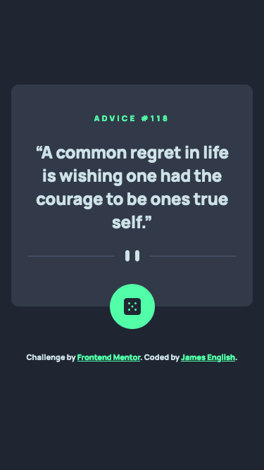
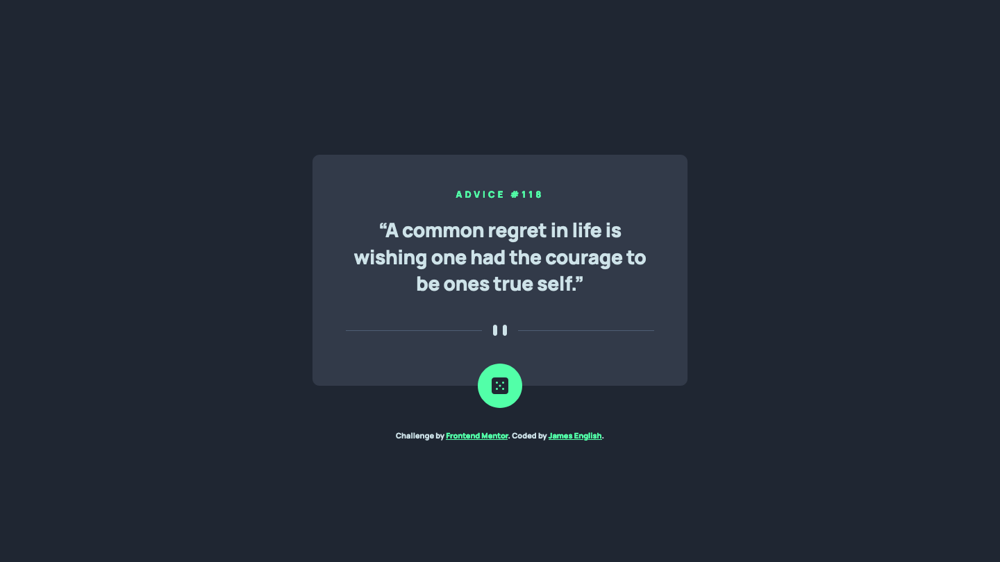
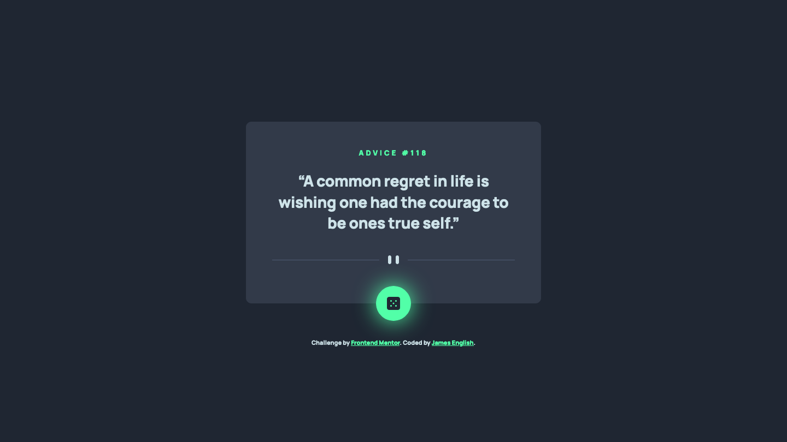

# Frontend Mentor - Advice generator app solution

This is a solution to the [Advice generator app challenge on Frontend Mentor](https://www.frontendmentor.io/challenges/advice-generator-app-QdUG-13db). Frontend Mentor challenges help you improve your coding skills by building realistic projects.

## Table of contents

- [Overview](#overview)
  - [The challenge](#the-challenge)
  - [Screenshots](#screenshots)
  - [Links](#links)
- [My process](#my-process)
  - [Built with](#built-with)
  - [What I learned](#what-i-learned)
  - [Continued development](#continued-development)
- [Author](#author)

## Overview

### The challenge

- View the optimal layout for the app depending on their device's screen size
- See hover states for all interactive elements on the page
- Generate a new piece of advice by clicking the dice icon

### Screenshots






### Links

- Solution URL: [Frontend Mentor](https://www.frontendmentor.io/solutions/mobile-first-design-using-scss-fetch-api-Jht0yexsst)
- Live Site URL: [Vercel](https://fem-advice-generator-app-delta.vercel.app/)

## My process


### Built with

HTML, SCSS and Javascript

### What I learned

Learned a bit about loading external data in Javascript using Fetch, in particular how to configure Fetch to reload new data instead of keeping what's in the cache:

````
fetch('https://api.adviceslip.com/advice', {cache: "reload"})
````

### Continued development

I want to continue developing front-end capabilities.

## Author

- Codepen - [@anglicus](https://codepen.io/anglicus)
- Frontend Mentor - [@anglicus](https://www.frontendmentor.io/profile/anglicus)
- FreeCodeCamp [@anglicus] (https://www.freecodecamp.org/anglicus)

